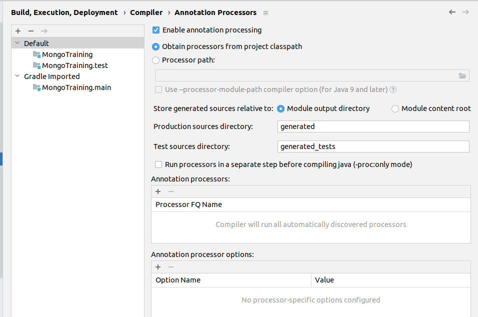

# MongoTraining

MONGO Immutables example with IntelliJ IDEA and Gradle.

`1. add dependencies to build.gradle
`
```
dependencies {
   implementation 'com.google.code.findbugs:jsr305:3.0.0'
   implementation 'org.immutables:mongo:2.8.2'
   implementation  'org.immutables:value:2.8.2'
   annotationProcessor 'org.immutables:value:2.8.2'
   testImplementation 'org.junit.jupiter:junit-jupiter-api:5.8.1'
   testRuntimeOnly 'org.junit.jupiter:junit-jupiter-engine:5.8.1'
}
```
2. `check that IDE annotation processing is on:
File -> Settings -> Build, Execution, Deployment -> Annotation processing:
`

Obtain processors from project classpath is ok.
Module output directory is ok.
3. `gradle clean build`
4. `check from build/generated/sources/annotationProcessor that files have been generated.`